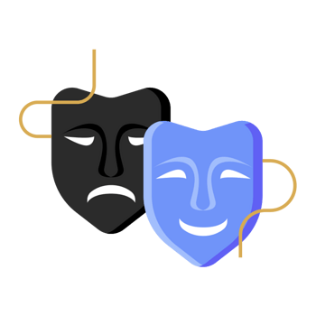

Hi! I'm Jee Jian Qi, a student in the Software Maintenance
and Evolution course.
I expect to learn a lot about modern software maintenance
practices and how to work with legacy systems.
- **Fun fact**: I love playing game.
- **Course expectations**: To learn about how to do maintenance on the system that may be used in my game development in the future (maybe).
 
## GitHub Profile
You can view my personalized GitHub profile
[here](https://github.com/jianqi02).
