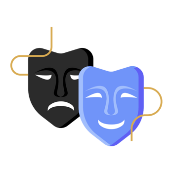

Hi! I'm Jee Jian Qi, a final year student in the Software Maintenance
and Evolution course. I am happy to learn about this course because it may be helpful when I need to do maintenance for my game system.
- **Fun fact**: I love playing game.
- **Course expectations**: To learn about how to do maintenance on the system that may be used in my game development in the future (maybe).
 
## GitHub Profile
You can view my personalized GitHub profile
[here](https://github.com/jianqi02).

